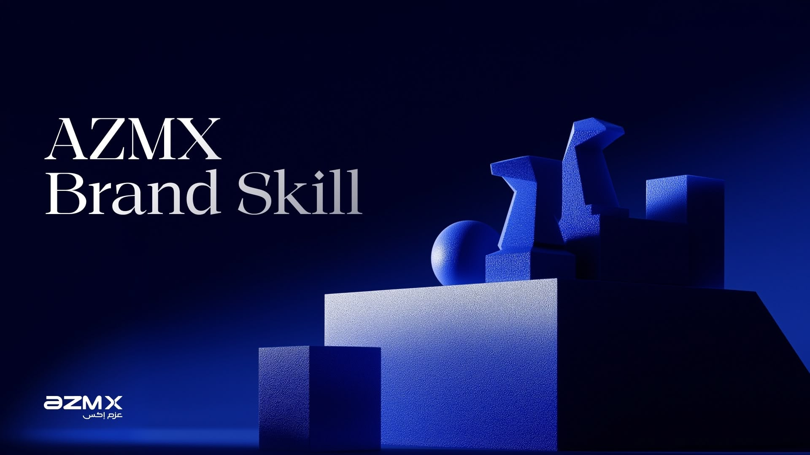

# azmx

[](https://github.com/Gamaleldientarek/azmx/actions/workflows/validate.yml)

The AZMX design systems as Agent Skills for [Claude Code](https://claude.com/claude-code), Cursor, Codex and Copilot. One repository per skill. This one is the hub: the install commands, the guide for non-technical people, the plugin marketplace, and the frozen assets that keep older links alive.

Maintained by [Gamal Eldien](https://gamaleldien.com).

## Install

One command per skill. Needs [Node.js](https://nodejs.org), nothing else.

```bash
npx skills@latest add Gamaleldientarek/azmx-brand -g -a claude-code -y
npx skills@latest add Gamaleldientarek/colab-design -g -a claude-code -y
npx skills@latest add Gamaleldientarek/majarah-design -g -a claude-code -y
```

Restart Claude Code. From then on, ask for anything AZMX, Colab or Majarah branded and the right skill loads on its own, or call one directly with `/azmx-brand`, `/colab-design` or `/majarah-design`.

- **Update everything you installed:** `npx skills@latest update -g`
- **Cursor, Codex or Copilot:** the same command with `-a cursor`, `-a codex` or `-a github-copilot`. `-a '*'` installs into every tool on the machine. Claude Code reads `~/.claude/skills/`, the others read `~/.agents/skills/`.
- **Not comfortable in a terminal?** [INSTALL.md](./INSTALL.md) walks through it step by step and can be forwarded to anyone.

### As Claude Code plugins

For Claude Code users who want the skills to keep themselves up to date:

```
/plugin marketplace add Gamaleldientarek/azmx
/plugin install azmx-brand@azmx
/plugin install colab-design@azmx
/plugin install majarah-design@azmx
```

Plugins refresh in the background, so a release in any skill repository reaches everyone without anyone running anything. Automatic invocation is unaffected.

Pick one route. Installing through both puts two copies of a skill on the machine. If you installed the earlier `azmx@azmx` bundle, remove it first with `/plugin uninstall azmx@azmx`.

To have a project prompt its collaborators automatically, add this to the project's `.claude/settings.json`:

```json
{
  "extraKnownMarketplaces": {
    "azmx": { "source": { "source": "github", "repo": "Gamaleldientarek/azmx" } }
  },
  "enabledPlugins": {
    "azmx-brand@azmx": true,
    "colab-design@azmx": true,
    "majarah-design@azmx": true
  }
}
```

## The skills

| Skill | Carries | Repository |
|---|---|---|
| **AZMX brand** | Colors and 587 design tokens, typography, logos, fonts, the email design system, voice and tone, the unified communication strategy, the Figma to fillable-PDF pipeline | [`azmx-brand`](https://github.com/Gamaleldientarek/azmx-brand) |
| **Colab design** | Palette with verified contrast rules, type scale, the 8-column slide grid, 14 layout archetypes, the pixel and dither graphic language, EN/AR rules | [`colab-design`](https://github.com/Gamaleldientarek/colab-design) |
| **Majarah design** | Eleven-variable palette with a measured contrast matrix, the Oswald/Helvetica type system, the 1920×1080 slide grid, twelve layout archetypes, the EN/AR variable architecture | [`majarah-design`](https://github.com/Gamaleldientarek/majarah-design) |

Each repository is one self-contained skill in the standard Agent Skill layout: `SKILL.md` at the root, `references/` loaded on demand, `assets/` for logos, fonts and templates, `scripts/` for build and QA tooling, and a `CHANGELOG.md`. Releases are per repository.

## Explore

| | |
|---|---|
| 🖼 **[Image library](https://gamaleldientarek.github.io/azmx-brand/)** | all 240 AZMX brand images, tagged and downloadable |
| 🎛 **[Token explorer](https://gamaleldientarek.github.io/azmx-brand/tokens.html)** | 587 design tokens with live previews and copy-to-clipboard |
| 🔌 **[Brand API](https://gamaleldientarek.github.io/azmx-brand/api-docs/)** | read-only JSON: tokens, palettes, typography, voice, personas, prompts, images |

## Frozen assets

Between 1 August and 7 September 2026 the three skills lived inside this repository, and links of the form `raw.githubusercontent.com/Gamaleldientarek/azmx/main/<skill>/assets/...` were published in that window. The `brand/`, `colab/` and `majarah/` folders keep those assets exactly as they were on 7 September, so every such link keeps resolving. The old gallery address, `gamaleldientarek.github.io/azmx/brand/`, still works for the same reason.

These folders are frozen on purpose: CI fails any change to them, and nothing new is added. New work lives in the per-skill repositories. There is no skill left to install from this repository.

## History

| Date | Change |
|---|---|
| 2026-08-01 | Three skill repositories and one app consolidated here as a monorepo |
| 2026-09-07 | The app moved back to its own repository. The three skills moved to their own repositories again, with full history. This repository became the hub |
| 2026-09-10 | The AZMX image library moved to [`azmx-brand-cdn`](https://github.com/Gamaleldientarek/azmx-brand-cdn), served by jsDelivr. The copy frozen here is unaffected |

The original repositories from before the consolidation are archived and read-only. Their `raw.githubusercontent.com` URLs continue to resolve, so any asset link published before then still works.

## Contributing and support

- Install trouble? Start with [INSTALL.md](./INSTALL.md), then open an issue on the skill's own repository.
- Changes to this hub go through a pull request. CI validates the marketplace manifest against the three skill repositories, checks every link in the two guides, and confirms the frozen folders are untouched. The same check runs locally with `python3 scripts/check-hub.py`.
- Security reports: see [SECURITY.md](SECURITY.md).

## License

The AZMX, Colab and Majarah brand systems, logos, images and the AzmX and thmanyah serif display fonts are the property of AZMX and its licensors, and are licensed for AZMX work only. This repository and the three skill repositories package them for AI-assisted design work. They grant no right to use the marks or assets elsewhere, or to redistribute the fonts.
